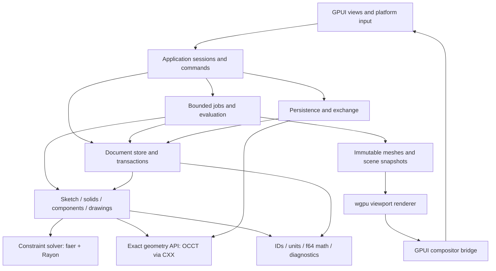

# Confusion architecture

## Scope and status

Confusion is a local desktop parametric CAD application using GPUI. The target is
Fusion-equivalent workflows for **sketches, solids, components/assemblies and
technical drawings**, rather than an MVP. Sketch and model are the two primary
modes. Drawing sheets and assembly tools are contexts within model mode.

There are no cloud features, accounts, network services, CAM, sheet-metal workflows,
simulation, electronics, subdivision modeling or dedicated mesh editing workbenches.
Reference/import meshes and GPU tessellation are supporting data, not extra modes.
Surface geometry is needed inside solid algorithms; a separate surface-design
workbench is outside the agreed scope.

This repository contains a **compilable architecture scaffold, GPU viewport and working
planar sketch → exact extrusion workflow**. The current document schema, length expression
parser, constraint solver, OCCT bridge, background worker, `.con` persistence and sketch/model
UI are implemented. Most other modules describe proposed APIs in their top comments.
See [parametric-workflow.md](parametric-workflow.md) for supported modeling behavior and
[viewport-proof.md](viewport-proof.md) for compositor integration. See [file-map.md](file-map.md)
for all source contracts, [libraries.md](libraries.md) for dependencies and
[feature-parity.md](feature-parity.md) for the completion checklist.

## Decisions

1. Exact solids use Open CASCADE Technology (OCCT), behind an owned narrow CXX
   bridge. Application code sees our geometry interfaces and semantic IDs.
2. Canonical design intent is a current-state dependency graph of parameters,
   sketches, constraints, features, components and associative drawings. It is
   neither a sequence of clicks nor a chronological edit timeline.
3. Geometric constraint solving is an owned Rust implementation using `faer` for
   linear algebra and Rayon for bounded parallel work. Numerical algorithms are
   isolated behind a solver interface so a proven alternative can be evaluated.
4. GPUI handles windows, controls, focus, input and composition. A separate `wgpu`
   renderer handles depth-tested 3D meshes, edges, picking and CAD overlays.
5. Workers consume immutable document snapshots. A session owns the document's
   single writer and accepts results only for the matching revision/request.
6. `.con` is a versioned container of current parametric intent and required source
   assets. Application settings, including all keybindings, live in one JSON file.
7. Undo/redo remains available in memory. Undo stacks, command logs and edit
   chronology are never saved into `.con`.

## Layers and dependency direction



The diagram includes data flow into rendering; the source-level dependency rules
below distinguish that from code imports:

| Layer | Modules | Allowed dependencies |
| --- | --- | --- |
| Vocabulary | `foundation`, `parameters`, `materials` | Vocabulary, generic libraries; no GPUI or native handles |
| Declarative domains | definitions in `sketch`, `model`, `assembly`, `drawing` | Vocabulary and semantic reference types |
| Document state | `document` | Declarative domain definitions and vocabulary |
| Computational adapters | `solver`, `kernel` | Vocabulary and domain inputs; never application/UI |
| Domain algorithms | feature evaluators, sketch profiles, assembly kinematics, drawing projections | Domain inputs and computational adapter interfaces |
| Evaluation | `evaluation` | Snapshots, dependency graph, domain algorithms, job contracts |
| IO | `persistence`, `exchange`, `settings` | DTOs, vocabulary, domain state, native/file adapters as needed |
| Viewport | `render`, `interaction` | Immutable results, selection/input contracts and geometry query interfaces |
| Coordination | `runtime`, `commands`, `tools`, `application` | Lower layers; composition may inject implementations |
| Presentation | `ui`, `platform` | GPUI, application interfaces, viewport bridge and native services |

`runtime/jobs` and `runtime/cancellation` are low-level contracts; the scheduler is
an upper-level executor. Avoid importing the concrete scheduler into numerical code.
Similarly `document/references` is vocabulary, not a dependency on the mutable store.
Feature metadata must be UI-independent: GPUI editors consume it rather than making
the domain import views. Where logical relationships point both ways, introduce an
input/result DTO or trait at the lower boundary instead of a callback into a session.

Start with the documented modules in one library to stabilize the design. Before
substantial implementation, extract workspace crates in dependency order:
`confusion-types`, `confusion-design` (all persistent domain definitions),
`confusion-solver`, `confusion-kernel`, `confusion-engine`, `confusion-io`,
`confusion-render`, `confusion-app` and the desktop binary. This enforces separation
without creating a crate for every sketch constraint or feature. In particular, the
design crate must not depend on the engine or solver implementation.

## Current parametric state without saved history

Persist enough information to reproduce the model, including operation definitions.
Discarding feature definitions and keeping only their B-reps would lose parametric
behavior. A feature such as an extrusion stores its sketch/profile references,
extent expression, taper, operation and output role. Its evaluated shape is a cache.

For example, a bracket document contains:

```text
width = 80 mm; height = 40 mm; thickness = 5 mm
sketch A: constrained rectangle driven by width and height
feature E: extrude(profile(A), thickness) -> body role "bracket"
sketch B: hole centers attached to E's named top face
feature H: cut hole profiles through body(E)
component C: owns sketches A/B and features E/H
drawing D: associative front/section views and dimensions of body(H)
```

Changing `width` replaces the parameter's current expression, solves A, evaluates
E, resolves B's plane, solves B, evaluates H and updates D. Deleting or replacing
a feature updates the graph with explicit dependency repair. No prior widths,
creation timestamps, timeline indices or commands are required in the saved file.
Construction references, feature output provenance and branch seed values are
current state, not edit history. Boolean inputs may need explicit semantic order;
do not mistake that dependency for a chronology of user actions.

Parameters have dimension-checked expressions and stable IDs. Name resolution
occurs when editing an expression, so renaming a parameter cannot break references.
Configurations persist declarative parameter/suppression overrides. Parameter and
feature dependency cycles are rejected. Coincidence/joint constraint loops are
valid simultaneous equation systems, not invalid dependency DAG cycles.

## Identity, topology and precision

Use distinct UUID newtypes for documents, entities, constraints, sketches, features,
parameters, bodies, components and occurrences. A reusable component definition and
an instance of that component have different IDs. Runtime arrays/arenas can use
compact indexes, but disk and cross-subsystem references use durable IDs.

Face/edge references are a separate naming problem. Persist producer feature ID,
semantic output role, ancestry and geometric selectors. Every exact operation
returns generated/modified/deleted provenance. A consumer resolves a selector
against the newly evaluated topology. Geometric signatures are fallback evidence,
not sufficient identity by themselves. Split/merged faces can produce an ambiguity;
show a repair workflow instead of silently attaching a dimension or joint elsewhere.
Topological naming needs dedicated regression fixtures from the first solid feature.

Use `f64`, right-handed Z-up frames and canonical SI quantities in domain code.
Keep angular computation in radians and display units separate. Adapt meters to the
chosen OCCT working length scale at the kernel boundary with an explicit tolerance
policy. Camera-relative `f32` coordinates feed GPU buffers; document geometry is
never rounded to GPU precision. A pixel snap radius is not a solver/kernel tolerance.

## Transactions and interactive tools

Menus, shortcut actions and command search resolve the same stable command IDs.
The dispatcher validates context and produces an atomic `DocumentPatch`. Structural
validation precedes commit; successful commit increments the session revision and
emits a semantic change set. Inverse patches feed bounded undo/redo stacks.

A tool follows activate -> pick/input -> preview -> accept or cancel. Its state
contains transient selections, argument values and a preview token. Dragging a
dimension or feature manipulator creates replaceable preview requests against an
immutable committed snapshot. Acceptance validates one final transaction; cancel
discards the overlay and pending results. Coalesce one drag into one undo entry.
Invalid geometry can remain an explicitly failed feature definition for repair, but
must not masquerade as a successful result or overwrite unrelated current geometry.

Sketch editing attaches to a specific component and plane. Entering sketch mode
sets the sketch context, camera and tool/key scopes; exiting restores model context.
Components, drawings and geometric inspection change the model workbench without
introducing additional primary modes. The browser shows current dependencies and
editable feature definitions; it does not present a chronological history timeline.

## Multithreaded solver

Compile immutable sketch/joint inputs into variable blocks, scaled residuals,
analytic Jacobians and equation-to-source mappings. Use local dual numbers where
analytic derivatives become unwieldy and verify derivatives numerically in tests.
Driving dimensions add equations; driven dimensions measure the solution. Drag
targets are temporary soft objectives, never silently substituted for hard constraints.

Partition independent islands, eliminate fixed values and detect gauge freedom.
Solve coupled systems using damped least squares/trust regions with warm starts and
branch continuation. Sparse QR handles least-squares systems; rank-revealing QR/SVD
supports DOF diagnostics and small difficult subsystems. Do not use normal equations
alone to diagnose rank. Handle zero-length lines, singular tangent configurations,
nearly parallel geometry and incompatible constraints explicitly.

Rayon parallelizes independent islands and sufficiently large residual/Jacobian
assemblies. Budget threads across Rayon, faer and native algorithms rather than
nesting unrestricted pools. Stable ordering, tolerances and seeds make results
reproducible within documented numeric bounds. A worker returns values, rank/DOF,
residuals, conflicts, convergence state and revision stamp. Cancellation checkpoints
occur between phases and iterations. Overconstraint conflict search is bounded and
does not pretend that every returned set is mathematically minimal.

This is substantial numerical engineering, not a thin wrapper around a matrix
library. The interface permits benchmarking an alternate constraint backend without
changing sketches, transactions or `.con`. Solvers must pass a workflow/numerical
corpus before interactive CAD parity is claimed.

## Exact kernel and evaluation

OCCT supplies B-rep geometry and algorithms. It does not own the design graph, undo,
application settings, constraints or drawing associations. The private CXX boundary
catches native exceptions and exposes owned results, algorithm status, validity
diagnostics and provenance. Native shape handles remain inside a kernel session.
No unaudited `unsafe impl Send/Sync` is permitted for native objects.

Begin with one dedicated kernel worker for native operations and exchange, while
sketch solving remains parallel. Enable parallel native evaluation only after
auditing specific independent algorithms and their shared state. Meshing and STEP
transfer have separate capability/configuration contracts. A kernel worker may
continue after cancellation if the native routine lacks interruption, but its
obsolete result cannot publish.

Evaluation traverses dirty DAG layers: parameters -> planes/projections -> solved
sketches -> profiles -> solid features -> assemblies -> drawings/inspection.
Operations include all the relevant options (join/cut/new body, two-sided/to-object
extents, taper, thin walls, variable fillets, shell, draft, patterns and direct edits).
Direct manipulations create or replace declarative modifier definitions.

Cache by semantic input hashes, backend versions, tolerance and configuration.
Missing/broken inputs block dependents with source-linked diagnostics. Retain a
last-good image for interaction only with explicit stale status. Export is evaluated
against the requested current revision rather than whichever mesh happens to be on
screen. Reference meshes may be embedded for visual context, but become solids only
through an explicit validated conversion or an exact source import.

## GPU rendering and GPUI integration

Build immutable scene snapshots from exact tessellation and component transforms.
Use indexed meshes, instancing, edge buffers, normals and face/entity ID maps.
Separate shaded, depth, transparency, hidden-edge, selection and overlay passes.
Picking combines asynchronous GPU IDs with exact kernel refinement and sketch
proximity. Revision stamps prevent selecting an object from an obsolete scene.

GPUI owns the window/compositor. The viewport must integrate an offscreen GPU target
or a shared-device pass into that compositor, including resize, DPI, clipping, fences,
lease lifetime and device-loss behavior. Do not create a second independent swapchain
on the same native window. Avoid GPU -> CPU -> GPU transfers for every production
frame; readback is appropriate for picking and explicit image exports.

The installed GPUI 0.2.2 native `surface()` source supports CoreVideo on macOS only.
It has no public cross-platform `wgpu` viewport embedding API. Therefore the renderer
is isolated behind `ViewportSurface`, and **a compositor integration spike is an
early architectural gate**. Keep GPUI and implement/pin an owned compositor adapter
or a narrowly scoped GPUI fork; verify Linux, macOS and Windows before adopting the
revision. A GPUI-compatible wgpu fork is an alternative to benchmark, not an assumed
drop-in replacement. All GPUI-related dependencies must come from one compatible
revision. The viewport experiment now pins a GPUI-compatible WGPUI fork and its matching
wgpu Git revision. It supplies the shared-device surface seam; it does not yet prove
all platforms or production compositor robustness. See [viewport-proof.md](viewport-proof.md).

## Local files and settings

`.con` is a ZIP container with `manifest.json`, `design.json` and `assets/<digest>`.
The manifest identifies schema, required capabilities, asset content types, hashes
and optional evaluation/backend compatibility metadata. `design.json` is a DTO of
the current graph and associations, independent of implementation structs.
Imported exact bodies, textures, geometry fonts and component snapshots are required
assets and are embedded for offline reproducibility. Parametric bodies are regenerated.
Cache files are disposable local data and cannot be required to open a design.

Validate sizes, hashes, path names, entity IDs and feature kinds before constructing
the document. Perform explicit schema migrations; unsupported future versions are
read/reported without destructive rewrite. Deterministic saves exclude incidental
ZIP timestamps. Atomic same-directory replacement protects interrupted writes.
Autosave stores complete current-state recovery snapshots, not replay journals.

STEP uses OCCT XDE to carry exact shapes, component hierarchy, names, colors and units.
STL uses dedicated export-quality tessellation, manifold checks and explicit scale;
STL does not encode units, constraints or parameters. STEP likewise does not carry
Confusion's feature graph. DXF/SVG support sketch/drawing interchange; vector PDF
supports technical sheets. Import reports identify unsupported/lost content.

All application preferences live in one platform-native `settings.json`: rendering,
solver budget, units defaults, navigation, theme, panels, recovery and keybindings.
Document-specific physical units/materials and saved views are design data in `.con`.
Logs, caches and recovery snapshots are runtime files, not additional settings stores.
Hot reload keeps the last valid configuration when JSON is malformed and preserves
unknown future fields where practical. Validate named command IDs and key conflicts.

Context predicates distinguish mode, active tool/stage, focus and selection. Binding
precedence is modal tool -> focused control -> mode -> global, with explicit conflict
handling and platform modifiers. Text input must capture typing before letter shortcuts.
Fusion defaults are built in; overrides live in the same JSON file. Verify those defaults
against primary Autodesk documentation when implementing them rather than inventing
an apparently complete shortcut table now.

## Components and drawings

Components own sketches, features and bodies; occurrences reference definitions with
separate local frames and visibility. Support nested instances, active-component
editing, embedded linked component snapshots, origin geometry and suppression.
Assembly joints cover rigid/revolute/slider/cylindrical/pin-slot/planar/ball freedoms,
limits, joint origins, as-built joints, rigid groups and motion links. The geometric
solver evaluates joint equations; exact geometry queries support interference tests.
No accounts or remote component resolution are needed. Explicitly refreshing a local
linked component replaces its embedded snapshot and reevaluates dependents.

Drawings persist sheets, model/configuration references, view definitions, annotations,
templates and title blocks. OCCT hidden-line removal and section geometry produce
projected view curves. Dimension anchors use semantic topology; moving a view keeps
dimensions associated. Implement orthographic/projected/section/detail/auxiliary and
exploded assembly views, BOM/balloons/hole tables, tolerances, GD&T, datums and common
symbols. Drawing standard selection changes layout/formatting rules, not model intent.
PDF/DXF libraries encode output; they do not implement associative drafting or standards.

## Implementation gates and validation

The sequence below retires architectural risks; it does not reduce the completion
target to an MVP. Every in-scope workflow in the parity checklist must eventually pass.

1. **Backend proofs:** GPUI GPU presentation on all supported platforms; CXX/OCCT
   solid + Boolean + fillet + named topology + XDE round trip; multithreaded sketch
   solving with dimensional expressions, DOF and conflict diagnostics.
2. **Durable design:** IDs, schema, graph validation, transactions, parameter evaluation,
   in-memory undo, atomic `.con` round trip, settings migration and contextual keymaps.
3. **Vertical modeling path:** constrained bracket -> extrusion -> hole -> fillet ->
   component instance/joint -> associative section drawing -> STEP/STL/PDF. Reopen
   `.con`, change a parameter and regenerate every associated result without history.
4. **Full workflow coverage:** implement the complete tool/option matrix, assemblies,
   configurations, drafting standards, direct edits and geometry failure repair.
5. **Quality parity:** compatibility corpus, large assemblies, solver stress tests,
   cross-platform interaction/accessibility, recovery and reproducible packaging.

When implementation exists, test solver residual/Jacobian agreement, convergence and
rank on numerical fixtures; topological naming across parameter/feature changes;
no-history persistence/reopen; schema migrations; transaction atomicity; stale job
rejection; export units/manifold/assembly data; and drawing associations. Benchmark
drag latency, independent solver speedup, exact operation time, frame time and memory
on recorded representative designs. Set quantitative budgets from target hardware
and reference workflows rather than asserting unmeasured latency guarantees.

The largest remaining engineering risks are robust numerical solving, persistent
topological naming, fillet/Boolean failure recovery, exact profile extraction,
cross-platform GPU composition and associative drafting. Each has its own files and
contracts so failures can be isolated and repaired without redefining the saved model.

## Current implementation boundary

The initial planar intent DTO is consolidated in `document/schema.rs`; parameter evaluation
and solving consume this immutable DTO. The workspace temporarily composes gestures,
document transactions, in-memory undo and rendering in `ui/viewport.rs`, with background
execution isolated in `runtime/worker.rs`. Split these responsibilities along the planned
contracts as more entity/feature types arrive, and extract common parameter/domain types
before turning these namespaces into separate crates. The native adapter currently rebuilds
one prism per evaluation and returns values; retained exact-shape sessions and semantic
face naming are future requirements for additional features and export.
