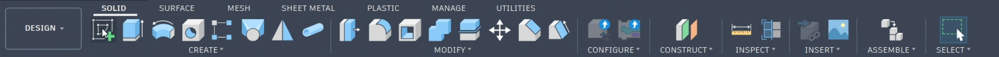
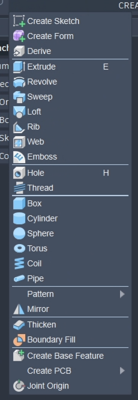
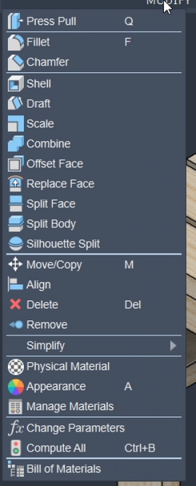

In the solid menu, fusion tools include extrude, revolve, suite, loft, rib, web, emboss, hole, thread, box, cylinder, sphere, torus, coil, pipe, pattern mirror, thicken, boundary fill, and gear.

In the modify menu, Fusion includes press pull, fillet, champ for shell, draft, scale, combine, offset, phase, replace phase, split body, split face, silhouette, split. Move, copy, align, delete, remove, simplify appearance

In the Construct menu, Fusion includes offset plane, planet angle, tangent plane, mid plane, perpendicular plane, plane through two edges, plane along three points, plane along path, plane through cylinder cone torus, access through cylinder cone torus, access perpendicular to face, access through two points, access through two planes, access through edge, vertex of point, point through two edges, point through three planes, point at the center of a circle, point at the edge and plane, point along path

