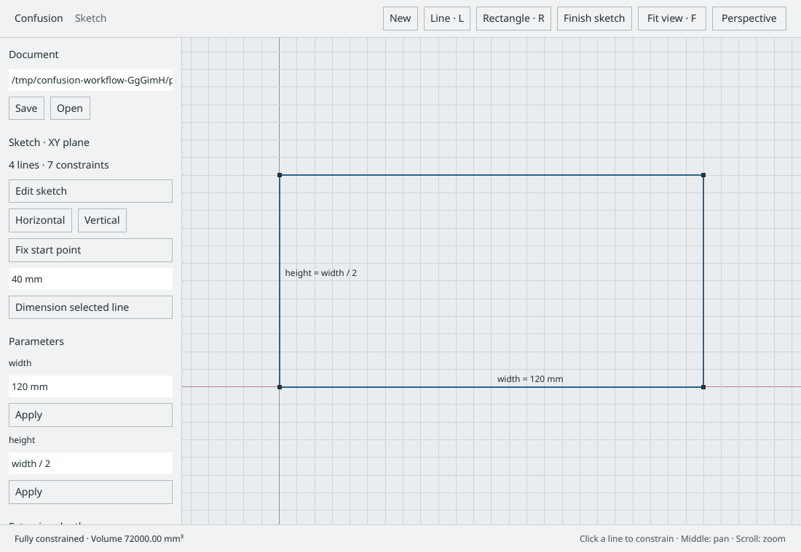
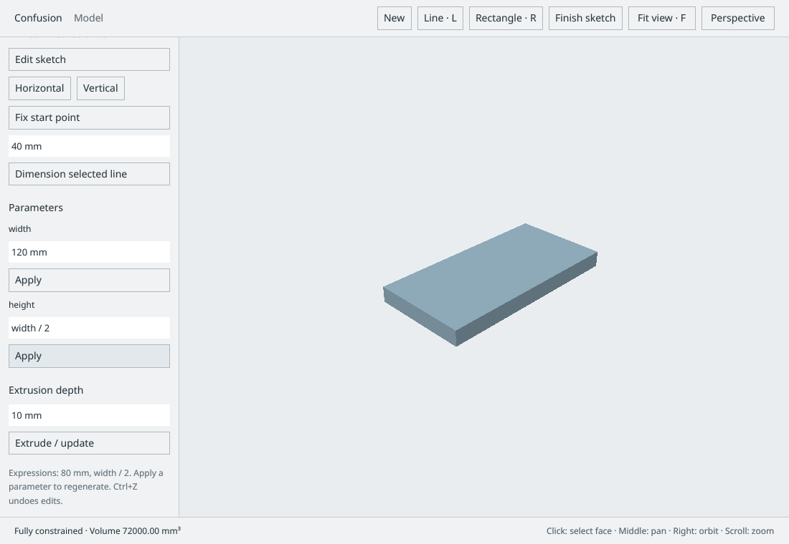

# Planar sketch → parametric solid

This implementation connects the previously validated GPU viewport to an owned local
CAD document, a background constraint solver, exact OCCT extrusion, and `.con` storage.
It is the first complete modeling path within the larger feature-parity architecture.

## Try it

Run `nix-shell --run 'cargo run --features desktop --locked'`.

1. Press **R** or choose **Rectangle**, then click two opposite corners. The XY sketch
   creates four shared endpoint IDs, four horizontal/vertical constraints, a fixed
   corner, and driving `width` and `height` parameters. The status should read
   **Fully constrained**.
2. Change a parameter expression in the sidebar and click **Apply**. Length literals
   accept `mm`, `cm`, `m`, and `in`. Expressions can reference other named lengths,
   such as `width / 2 + 5 mm`. Arithmetic is dimensional; cycles and invalid units fail.
3. Enter `10 mm` in **Extrusion depth**, then click **Extrude / update**. OCCT builds
   and validates an exact B-rep prism, calculates volume, and derives the GPU mesh.
4. Change `width` again and click **Apply**: the sketch and solid regenerate. Use
   **Edit sketch** to inspect the solved profile and its dimension annotations.
5. Enter a writable path ending in `.con` in the Document field, then click **Save**.
   **Open** loads that path and regenerates the sketch/solid from its intent.

**L** draws connected line chains; click successive endpoints and **Escape** ends
creation. Nearby existing endpoints snap to the same point ID. Horizontal/vertical
segments infer their corresponding constraints. Click a line in selection mode to
apply horizontal, vertical, fixed-start-point, or driving length constraints. The
sidebar also lets you remove its constraints to recover from a conflict.

The sketch snaps to a 1 mm grid. Middle/right drag pans the sketch; scrolling zooms.
In model mode, click selects a face, middle drag pans, right/Shift+middle drag orbits,
scrolling zooms, and **F** fits. The projection toolbar switches perspective/orthographic.
**Ctrl+Z/Ctrl+Y**, with the viewport focused, undo/redo document edits in memory.
Input fields support selection, clipboard and printable keyboard input; edits are committed by
Apply or Extrude, not by typing. Keymap configuration remains future work.

## Boundaries and data flow

- `document/schema.rs`: current SI-valued intent and UUID references. Shared endpoints
  encode coincidence without an additional residual. Constraints and extrusion depth
  reference parameter UUIDs; expression names currently cannot be renamed in the UI.
- `parameters/expression.rs`: bounded, safe parser with dimensional checks and
  dependency-cycle detection. All named parameters in this workflow are lengths.
- `solver/nonlinear.rs`: analytic residual/Jacobian rows evaluated with Rayon; faer
  solves damped normal equations and computes singular values for local DOF. Coordinates
  are scaled to millimetres internally. Nonzero residuals identify affected constraint
  IDs; these are not a minimal unsatisfiable constraint set. Redundancy classification,
  decomposition and advanced nonlinear continuation remain architecture work.
- `runtime/worker.rs`: owned immutable snapshots, one replaceable pending request and one replaceable result slot,
  cancellation between solve iterations, revision filtering, and worker-local OCCT.
  Native meshing cannot be interrupted mid-call. The UI never accepts an obsolete
  revision, and clears its solid when a new evaluation is requested or fails.
- `sketch/profiles.rs`: validates a single simple closed loop; rejects open, branching,
  disconnected, degenerate and self-intersecting profiles before native evaluation.
- `kernel/bridge.rs`, `kernel/native/occt.cpp`: value-only CXX boundary, OCCT 7.9.3 in
  the Nix environment. Exact B-rep and triangulation ownership never cross FFI. Native
  millimetres become SI values at the boundary. Face IDs identify the current display
  mesh only; persistent topological naming and keeping exact shape sessions for further
  feature operations are not implemented by this extrusion adapter.
- `persistence/container.rs`: version-1 ZIP with `manifest.json` and `design.json`,
  structural checks, size limits and atomic replacement in the destination directory.
  No solver results, triangles, B-rep cache or edit history are stored. Undo is session
  memory only. The UI refuses to overwrite an existing path it has not opened/saved.
- `ui/viewport.rs`: document/gesture orchestration and mode-sensitive navigation.
  Sketch graphics use GPUI's GPU compositor; solid rendering and picking use shared
  wgpu device/queue resources. Metres are multiplied by 25 for display only.

## Current limits

One XY sketch, straight lines, one simple profile and one positive-depth new-body
extrusion. No arcs, circles, holes, profile chooser, multiple bodies/components,
booleans, imported geometry, STEP/STL export, or drawings yet. No native file picker
or autosave yet; the Document field takes a local path. The sketch currently limits
128 points, 128 lines, 256 constraints and 128 length parameters to bound dense solves.
The pinned WGPUI cross/winit backend has no IME event forwarding yet; the input handler
implements UTF-16 composition contracts, but real IME composition remains unvalidated
and requires a backend change. Continuous redraw inherited from the viewport experiment still needs idle scheduling.
This workflow does not claim Fusion feature parity; the architecture remains the full
roadmap for sketches, solids, components and drawings, with no cloud services.

## Validation

`tests/parametric_workflow.rs` exercises dimensional expressions/cycles, schema reference
validation, reverse-corner rectangles, DOF/conflicts, invalid profiles, intent-only
save/reopen, and exact volume/dimension regeneration through the real native kernel.
Run `nix-shell --run 'cargo test --features solver,kernel'` and
`nix-shell --run 'cargo clippy --all-targets --features desktop -- -D warnings'`.

Native X11/Xvfb verification on the RTX 3080 Ti also covered rectangle creation,
printable text editing, named expressions, extrusion, Save → New → Open regeneration,
conflict identification and undo, line-chain closure/DOF, GPU face selection, and window
resize. Headless checks, native integration tests, strict Rust Clippy, formatting and the
GPU smoke checks passed. Windows, macOS, Wayland and real IME composition are unverified.

