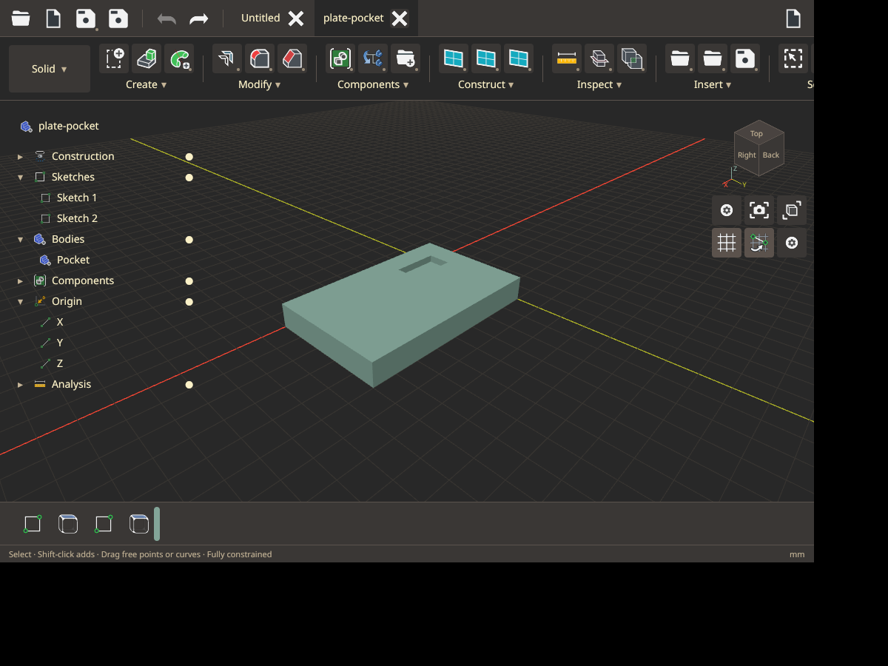

# Native user interface

The GPUI shell follows the supplied Fusion references, using Zed's Gruvbox Dark
palette. The FreeCAD flat SVGs are embedded so launching from another working directory works. Small constraint glyphs keep geometry readable.

## Layout and controls

- Top left: Open, New, Export, Save, Undo and Redo. Open and initial Save use system file dialogs for choosing the folder and filename. Ctrl+Shift+S opens Save As. Export lists STEP and STL as not implemented.
- Open designs occupy separate named tabs with close buttons and a plus to create a new design; each tab keeps its own design and undo/redo stacks. The large workspace dropdown at the left of the ribbon selects Solid, Sketch or Drawing. The ribbon shows compact
  tool groups; each group menu exposes its complete named tool list and a pin toggle. Pinned tools persist in the single local JSON settings file at `$XDG_CONFIG_HOME/confusion/settings.json` (default `~/.config/confusion/settings.json`), preserving unrelated settings fields. Hover tooltips
  identify icons and unsupported tools. Unsupported commands also report their status
  when clicked. Drawing currently displays a sheet placeholder.
- The floating tree overlays the viewport and includes collapsible Construction, Sketches, Bodies, Components, Origin
  and Analysis categories. Components are organizational collections of separate
  bodies; their creation and editing tools are placeholders pending the backend.
- The upper right has the orientation cube, Home, projection, Fit, Grid, Snap and view
  options. Click a visible cube face or right-click it for all six cardinal views.
  Sketch editing uses the local XY coordinates of its selected plane. Middle drag pans, Shift-middle drag uses constrained orbit,
  and Ctrl-middle drag uses free orbit. Wheel zooms. Grid snapping uses a 1 mm step.
- Contextual panels contain document paths, current parameters, extrusion depth/operation/target,
  dimensions or view options. Escape closes panels and menus.

The catalog covers sketch creation and constraints; solid creation, modification,
components, construction and inspection; and drawing views, annotation and sheets.
Only the existing line/rectangle, supported constraints, parameter and extrusion
workflow is active. Unimplemented features remain visible and clearly identified.

## Construction versus edits

The bottom timeline is **persistent construction**, separate from undo and redo.
Sketch and extrusion entries retain source-sketch, plane and target dependencies. Feature IDs
remain stable when parameters change. Extrude references its source sketch by ID.
Clicking a sketch edits its parameters and evaluates the construction through that
sketch; downstream extrusion intent remains in the canonical design. Restoring the
end regenerates the extrusion using the current parameters. Clicking the extrusion
opens its depth editor. Drag the narrow marker left or right to move the evaluation point, including before the first feature; no timeline transport buttons are shown.

Saving writes current feature definitions and dependencies to version 6 `.con`.
Version 1 files load with a synthesized construction sequence. No previous parameter
values, undo stack or derived meshes are saved. Undo/redo hold session snapshots in
memory. Multiple sketches and exact extrusion joins/cuts now use this dependency model; solid patterns remain unfinished.

## Modules and checks

`ui/viewport.rs` owns interactions and composition; `toolbar.rs` owns the feature
catalog; `components.rs`, `theme.rs` and `assets.rs` provide shared controls and styling.
`sketch_canvas.rs` paints the sketch and `view_cube.rs` supplies camera-linked cube
geometry/picking. `render/grid.rs` paints the depth-tested model grid.

Validation uses solver/kernel integration tests, cardinal camera and cube-picking
tests, desktop Clippy, the GPU renderer/picker smoke example, and native X11/Xvfb
interaction checks. Screenshots in `docs/assets/ui-*.png` show the actual GPUI window.

The native verification created a 40 × 20 × 10 mm extrusion, edited width through
the sketch timeline entry to 60 mm, and observed volume change from 8,000 to
12,000 mm³. Saving and reopening retained the same two construction entries.
Projection, cube selection, constrained/free orbit and a 900 × 650 window were
also exercised. Automated checks passed 18 tests, desktop Clippy and the GPU smoke
check on an NVIDIA RTX 3080 Ti.

The revised shell uses 40 px tool buttons, 28 px artwork and 14 px interface text.
The footer only displays errors when needed and `mm` at the right, with no Ready
message or volume counter. The semantic artwork checklist is in
[Icon inventory](icon-inventory.md), with a matching CSV for icon-pack production.

Native checks for the document-tab revision covered creating a rectangle, opening a
second blank document, returning to the original sketch, extruding it, and dragging
the marker back to the sketch and forward to the complete solid. A local file opened
in a named second tab; closing it retained the first tab. Pinning Sweep added a fourth
Create tool and survived a fresh launch using an isolated settings directory. The
settings test confirms that unrelated JSON keys survive and malformed JSON is not
overwritten. The current suite passes 19 tests and desktop Clippy.


## Expanded sketch workflow

The sketch implementation now includes curved geometry, dimension placement and editing, constraint icons, constrained dragging, crossing/window selection, measure, linked offsets, trim/extend, fillets, and transforms. The footer reports sketch DOF and redundancy during editing. See [Sketch workflow](parametric-workflow.md) for current controls, configurable shortcuts, a fully constrained example, and implementation limits. This section supersedes earlier descriptions of sketch tools as placeholders; tools still marked **Not implemented** remain unavailable. The current `.con` format is version 6.

## Floating editors and keyboard entry

Contextual editors float inside the model viewport. Tab and Shift-Tab cycle through the current editor's fields and select the value for replacement. Enter confirms extrusion, dimensions, transforms, offset, fillet and parameters. Escape closes the editor and returns focus to the viewport. Invalid values retain the editor and show the error beside its controls. Dimension entry opens beside the geometry immediately after selecting a line. Click an existing dimension to edit its value; drag its line or label to reposition it.

The project tree uses a transparent surface, compact disclosure rows and indented children. Click a branch to expand or collapse it; its visibility control operates independently. Supplied FreeCAD flat artwork replaces the LibreCAD icons.

The sketch toolbox supports Up/Down selection and Enter to run the highlighted matching tool. Dimension entry uses a compact on-canvas value box, with Apply and Driving/Driven controls.


## Face-attached sketches and extrusion operations

Select an unambiguous planar extrusion cap in Solid mode, then choose **Create sketch**. Sketches appear separately in the browser. **E** opens an extrusion editor with **New body**, **Join**, **Cut**, and **Cut and new body**; all operations except New body require a target body. Cut and new body preserves the removed material as a separately visible solid. A face-attached sketch defaults to an inward cut. Each feature keeps its own depth parameter. Timeline feature edits activate the correct source sketch and retain downstream intent. See [the plate-and-pocket workflow](parametric-workflow.md#multiple-sketches-and-solid-features) for the saved example and current attachment limits.

Native previews: [Inline dimension](assets/ui-inline-dimension.png) and [Floating extrusion editor](assets/ui-floating-editor.png). Verification exercised Tab/Shift-Tab through transform fields, dimension entry and Enter confirmation, toolbox filtering and Up/Down selection, invalid depth retention, extrusion confirmation, and single-press Escape cancellation.

Native model checks opened the saved plate-and-pocket example, changed pocket depth, created a third sketch on the surviving top cap, added a second pocket, and saved/reopened the resulting three-feature design. Headless exact regeneration confirmed a volume of 38,700 mm³. Fit after a pocket edit now uses the complete regenerated mesh. Worker results identify their solved sketch so earlier construction previews cannot replace active-sketch coordinates. The current solver/kernel suite passes 56 tests; desktop Clippy and formatting checks pass.




## Shared world and interaction feedback

Sketch and Solid workspaces share the same camera and model world. Starting or editing a sketch aligns the camera to its plane; bodies remain visible, and other sketches retain their own world positions. Orbit, pan, zoom, cube views and Fit work in either workspace. Individual sketch and body visibility controls sit on their tree rows; branch visibility hides the entire category. Drawing remains a separate sheet workspace.

Placement tools show a hover crosshair at the snapped position before you click. Hold Ctrl to suppress snapping. Constraint glyphs use 11 px artwork on a transparent 16 px target. In the extrusion editor, drag the yellow depth handle to adjust depth; the wire preview uses the same world frame as the sketch. Enter commits and Escape cancels.

The top-right counter samples rendered viewport frames over half a second and shows FPS plus frame interval in milliseconds. It is a display submission rate, not an independent GPU timer. Cube faces retain Top/Bottom/Front/Back/Left/Right labels. Red, green and blue axes run along three edges meeting at the nearest visible cube corner.

A changed document has a dot in its tab. Closing an unsaved tab or the window offers Save, Discard and Cancel. Window closure checks every open document. Canceling the system Save dialog retains the confirmation; a failed save retains the design and displays its error. Switching sketch, navigating the camera and toggling visibility do not mark a saved design dirty.

Solid/Modify controls, persistence, and current geometry limits are described in [Solid / Modify](solid-modify.md).

Native validation also exercised system file pickers through a private GTK portal session, saving to a chosen filename and reopening it. OS window close was canceled once, then completed with Discard.


Latest interaction captures: [depth handle](assets/ui-extrude-handle.png), [dimension dragging](assets/ui-dimension-drag.png), [body visible during sketch editing](assets/ui-shared-world.png), [unsaved window close](assets/ui-unsaved-close.png), and [system Save dialog](assets/ui-system-save.png). The depth handle test changed 5 mm to 13.942 mm before confirmation; the dimension test moved the annotation line 55 px away from its geometry. The focused desktop library and multi-feature tests pass (27 tests), including canonical dirty state across sketch switching, camera picking on an attached plane, and material preservation for Cut and new body.


Ribbon group menus (Create, Modify, Components, Construct, Inspect, etc.) open on hover. Moving between group labels switches the menu. Leaving both the label and its menu dismisses it after a 150 ms transition grace period; tool selection and clicking outside also dismiss it.

Failed solid evaluations end the busy state with “Evaluation failed” and retain the last valid model and attached sketch frames. The background worker reports evaluator panics as errors and remains available for subsequent edits. Moving only a dimension annotation changes layout and dirty state without invalidating in-flight geometry evaluation.

Native hover capture: [Create menu and cube corner axes](assets/ui-hover-menu.png). The focused desktop library suite passes 18 tests, including failed-cut recovery, evaluator panic recovery, and cube-edge geometry. Desktop Clippy across all targets and formatting checks pass.


## Retrospective sketch editing

Opening a sketch from the browser or timeline evaluates construction through that sketch. Earlier bodies remain visible; its own extrusion and later features are absent until **Finish sketch** restores the full timeline. Undo and redo retain this sketch editing position. Opening a sketch does not automatically show the Parameters editor. Click its dimension label to edit the expression directly beside the annotation, then press Enter.

Dimension extension lines are constructed on the sketch plane before projection, so their lines and labels move together when orbiting. Radius and diameter annotations use a radial leader instead of an offset linear dimension. Default annotation positions remain fixed in sketch coordinates when zooming.

**Create sketch** with an existing body prompts for a face, with an explicit **Use XY plane** alternative. The current attachment backend supports unambiguous planar extrusion caps. Unsupported or ambiguous faces report an error.

Click inside a closed sketch region to select its boundary and shade the selected region. Nested boundaries exclude holes. Points and edges take priority over region selection. Lines, circles, arcs, ellipses and fit/control splines bound selectable regions. Crossings and shared edges create individual faces; open tails do not block other closed faces. Press **E** after clicking the region to extrude precisely that face. Center rectangles, diameter/three-point circles, three-point arcs, ellipses, slots, polygons and splines display geometry previews before confirmation.

Native validation confirmed hover dismissal, [center rectangle preview](assets/ui-center-rectangle-preview.png), [region selection](assets/ui-region-selection.png), inline dimension entry, [retrospective sketch rollback](assets/ui-sketch-rollback.png), Finish restoring the body, and [choosing a sketch face](assets/ui-choose-sketch-face.png) followed by creating Sketch 2 on its cap. The focused desktop suite passes 19 tests; all-target desktop Clippy and formatting pass.

The native regression review exercises interior face selection, a divided rectangle and ellipse extrusion, and repair of a broken Modify face reference:

```sh
nix-shell --run 'python3 examples/sketch_region_review.py'
```

It uses an isolated instrumented application and configuration directory, with assertions in the real workspace.
