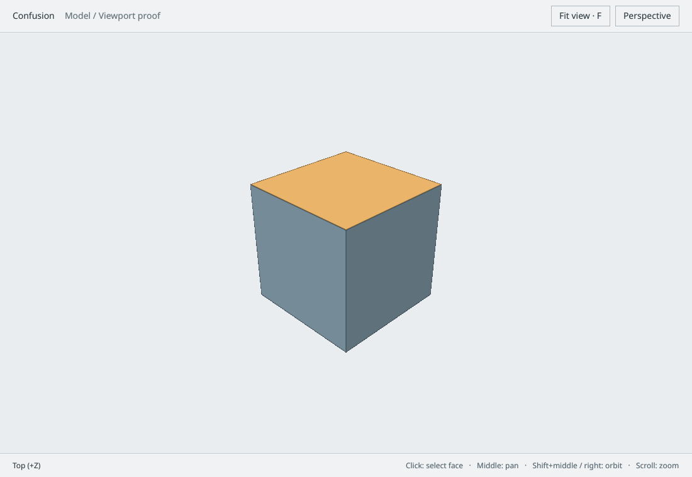

# GPU viewport proof

The first implemented path is a shaded, depth-tested cube inside a GPUI window,
with orbit, pan, zoom, fit, perspective/orthographic projection and GPU face selection.
This is a graphics integration experiment, not a parametric modeling implementation.
The cube is an immutable mesh fixture; no OCCT or document persistence is involved.

## Run

```sh
cargo run --features desktop --locked
```

On NixOS:

```sh
nix-shell --run 'cargo run --features desktop --locked'
```

The development shell supplies X11/Wayland/font development dependencies and GPU
loader paths. It uses the system's `<nixpkgs>` channel; it is not a pinned flake.
A working graphics driver and display server are required for the desktop view.
No accounts, cloud services or model network requests are used.

| Input                              | Behavior                                                        |
| ---------------------------------- | --------------------------------------------------------------- |
| Left click                         | Select the visible face, or clear selection on background       |
| Middle drag                        | Pan in the view plane                                           |
| Shift + middle drag, or right drag | Orbit around the view target                                    |
| Scroll                             | Zoom, bounded to avoid near/far extremes                        |
| F / Fit view button                | Center and fit the solid, retaining view orientation/projection |
| Escape                             | Clear selection and cancel pending selection                    |
| Projection button                  | Toggle perspective/orthographic                                 |

These controls are local to this proof. The planned single JSON settings file and
context-dependent command/keymap registry are not implemented yet.

## Code and GPU ownership

- [`render/camera.rs`](../src/render/camera.rs): f64 right-handed Z-up camera,
  screen-aligned pan, bounded orbit/zoom and WebGPU-depth projection matrices.
- [`render/scene.rs`](../src/render/scene.rs): outward-wound cube faces with IDs 1–6;
  zero is background. These temporary fixture IDs are not persistent topology names.
- [`render/renderer.rs`](../src/render/renderer.rs) and
  [`solid.wgsl`](../src/render/shaders/solid.wgsl): reusable buffers/pipeline, diffuse
  solid shading, antialiased face borders, selection tint, depth and integer ID targets.
- [`render/picking.rs`](../src/render/picking.rs): asynchronous 256-byte-aligned
  one-pixel R32Uint readback, bounded to one active request and revision-stamped results.
- [`render/gpui_bridge.rs`](../src/render/gpui_bridge.rs): the only fork-specific
  rendering adapter; gets the compositor's existing device, queue and target texture.
- [`ui/viewport.rs`](../src/ui/viewport.rs): GPUI layout, input, actual viewport bounds,
  stale pick rejection and status display. Normalize logical coordinates against
  layout bounds before mapping to the actual target pixels, including HiDPI/resize.
- [`application/bootstrap.rs`](../src/application/bootstrap.rs): one desktop window,
  shared-device surface creation and view startup.

GPUI owns the native window and its swapchain. Confusion renders into an offscreen
surface texture on the same wgpu device/queue. It submits the solid pass before the
GPUI compositor samples the ready texture. The fork composites encoded colors
into a non-sRGB swapchain, so the viewport uses an unorm surface with exactly one
linear-to-sRGB shader conversion. The smoke test checks this against standalone
hardware sRGB encoding. The adapter swaps buffers on the UI thread;
queue submission order establishes the texture dependency. There is no second
swapchain, cross-device copy or GPU -> CPU -> GPU frame upload. Picking reads one
texel only; explicit smoke screenshots use full-image readback outside the desktop path.

Targets follow the surface's atomically returned actual pixel dimensions rather
than guessed window dimensions. Depth and ID targets are recreated only on size
change. Pipelines, mesh buffers and uniform allocations persist across frames.
Pending pick results carry view revision and target-size stamps and cannot update selection
once navigation, a newer click, projection or target resize has invalidated their view.

## Dependency decision

Published GPUI 0.2.2 did not expose a cross-platform shared-device viewport surface.
This proof uses a pinned GPUI-compatible [WGPUI fork](https://github.com/nestrilabs/wgpui),
package `gpui-ce`, imported as `gpui`:

```text
GPUI fork: baa3f3b00839ee9567b81450f45a58c3a6c43cb8
wgpu fork: fce5b80e8017304449124b12637ec324417e40c8 (reports version 28.0.0)
```

The wgpu source and revision must match the fork's dependency. Otherwise identical
looking Device/Texture types come from separate crates and cannot be shared. The
root dependency explicitly enables Metal in addition to native backend features
provided by the fork. This is a testable adapter decision, not a guarantee of
upstream API stability or full cross-platform support.

The upstream GPUI utility package still pulls `xattr 0.2.3`, which references the
Linux `ENOATTR` constant removed from newer libc. Desktop currently constrains
`libc = 0.2.186` to keep that dependency building. Remove the constraint once the
utility dependency is upgraded, and rerun native checks. `Cargo.lock` includes the
full pinned resolution; use `--locked` for reproducible Rust dependency selection.

The fork also requires several optional GPU features at startup, including binding
arrays and indirect draw capabilities. Our cube renderer does not require those
features. Compatibility with lower-feature integrated/software adapters remains a
fork-level issue to audit before choosing a production backend.

## Validation

```sh
cargo fmt --all --check
cargo test --lib --locked
cargo test --lib --features gpu --locked
cargo check --all-targets --features desktop --locked
cargo run --features gpu --example viewport_smoke --locked -- /tmp/confusion-viewport.png
```

Run native commands in `nix-shell` on NixOS. Headless unit tests check target projection
and WebGPU depth, camera stability at extreme inputs, screen-plane panning, HiDPI
pick conversion, out-of-bounds rejection and fixture winding.

The GPU smoke example uses the exact desktop shader, renderer and async picker on
a real device. It validates:

- nearest visible face IDs from all six sides;
- background ID zero;
- selected-face shading changes;
- request revision/target-size stamps and consistent sRGB/unorm color encoding;
- odd-size and high-DPI-size target recreation;
- a saved PNG of the default solid view.

The first smoke run passed on Linux/Vulkan with an NVIDIA GeForce RTX 3080 Ti.
The PNG is a test-only readback. A separate native X11/Xvfb check verified the
GPUI window, initial focus, face selection, background clearing, orbit, pan, zoom,
projection switching, fitting and window resizing from 1100×760 to 900×650.
Picking was rechecked after resize. Screenshots were visually inspected. The user
also confirmed successful interaction with the normal desktop window at 125% DPI.
macOS, Windows and the native Wayland backend remain untested.



## Remaining production work

The view currently schedules rendering at display cadence to exercise composition,
resize completion and async readback. It is not yet an idle-optimized application.
Rendering command encoding occurs on the UI thread; solving and tessellation will
remain worker jobs, and larger rendering work may need a dedicated audited path.

Validate native window resizing, DPI transitions, GPU loss, minimized/hidden windows,
texture lease lifetimes and sustained input on each target platform. Linux runtime
checks do not prove macOS or Windows behavior. Audit the fork's buffer registry and
resize synchronization before relying on it for arbitrary concurrent render threads.
Startup/device-loss diagnostics and recreation are not complete yet.

Next, connect evaluated solid tessellation and semantic topology IDs to the scene,
then build the constrained-sketch -> extrusion vertical workflow. Keep this mesh
fixture and smoke check as renderer regressions while replacing the proof UI with
application sessions and configurable semantic commands.

## Anti-aliasing

The current solid and XY ground-grid color pass uses 4× MSAA with matching depth samples. Coverage resolves into a linear-light image before a presentation pass encodes it for GPUI's unorm surface or the standalone sRGB target. Face IDs are rendered separately at one sample per pixel, preserving exact integer picking. Color, depth, resolve, and picking attachments are recreated together on resize.

Native icons rasterize at the requested logical size multiplied by the window's display scale, with GPUI's built-in 2× SVG supersampling. A bounded cache keys images by icon name and physical display size. The supplied artwork and palette stay intact; the old large intrinsic raster followed by severe bilinear minification is bypassed.

The GPU smoke check covers fractional silhouette coverage, the MSAA grid, exact picking, both color output formats, and resizing. A desktop unit check verifies icon sizes and fractional alpha coverage at 16, 28, and 56 physical pixels.
